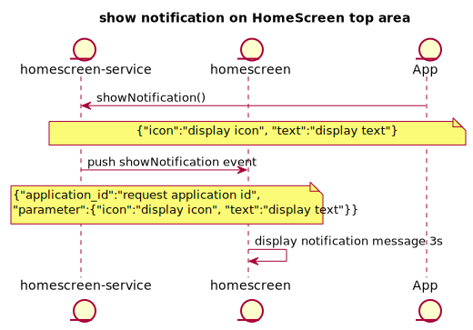

**HomeScreen GUI Application / HomeScreen Service Guide**
====
<div align="right">Revision: 0.1</div>
<div align="right">TOYOTA MOTOR CORPORATION</div>
<div align="right">Advanced Driver Information Technology</div>
<div align="right">21th/Mar/2019</div>

* * *

<div id="Table\ of\ content"></div>

## Table of content
- [Target reader of this document](#Target\ reader\ of\ this\ document)
- [Overview](#Overview)
- [Getting Start](#Getting\ Start)
	- [Supported environment](#Supported\ environment)
	- [Build](#Build)
	- [Configuring](#Configuring)
	- [How to call HomeScreen APIs from your Application?](#How\ to\ call\ HomeScreen\ APIs\ from\ your\ Application?)
- [Supported usecase](#Supported\ usecase)
- [Software Architecture](#Software\ Architecture)
- [API reference](#API\ reference)
- [Sequence](#Sequence)
	- [Initialize](###Initialize\ Sequence)
	- [Tap Shortcut(deprecated)](###Tap\ Shortcut\ Sequence)
    - [ShowWindow](###ShowWindow\ Sequence)
	- [On Screen Message / Reply Sequence(deprecated)](###On\ Screen\ Message\ /\ Reply\ Sequence)
    - [ShowOnscreen](###ShowOnscreen\ Sequence)
    - [ShowNotification](###ShowNotification\ Sequence)
    - [ShowInformation](###ShowInformation\ Sequence)
- [Sample code](#Sample\ code)
- [Limitation](#Limitation)
- [Next Plan](#Next\ Plan)
- [Appendix](#Appendix)

* * *

<div id="Target\ reader\ of\ this\ document"></div>

## Target reader of this document
Application developer whose software uses HomeScreen.

* * *

<div id="Overview"></div>

## Overview
HomeScreen is built with a GUI application created with Qt(referred as HomeScreenGUI), and a service running on afb-daemon (referred as HomeScreenBinder).
HomeScreen can start/switch applications run in AGL, also displays information such as onscreen messages.

You can find these projects in AGL gerrit.

homescreen(HomeScreenGUI):
    https://gerrit.automotivelinux.org/gerrit/#/admin/projects/apps/homescreen
launcher(LauncherGUI)
    https://gerrit.automotivelinux.org/gerrit/#/admin/projects/apps/launcher
agl-service-homescreen(HomeScreenBinder's binding library):
    https://gerrit.automotivelinux.org/gerrit/#/admin/projects/apps/agl-service-homescreen
libhomescreen(library for application to communication with HomeScreenBinder):
    https://gerrit.automotivelinux.org/gerrit/#/admin/projects/src/libhomescreen
libqthomescreen(library for qt application to communication with HomeScreenBinder based on libhomescreen)
    https://gerrit.automotivelinux.org/gerrit/#/admin/projects/src/libqthomescreen

Also HomeScreenGUI is using libwindowmanager.

<div id="Getting\ Start"></div>

## Getting Start

<div id="Supported\ environment"></div>

### Supported environment

| Item        | Description                       |
|:------------|:----------------------------------|
| AGL version | Electric Eel                      |
| Hardware    | Renesas R-Car Starter Kit Pro(M3) |


<div id="Build"></div>

### Build

**Download recipe**

```
$ mkdir WORK
$ cd WORK
$ repo init -u https://gerrit.automotivelinux.org/gerrit/AGL/AGL-repo
$ repo sync

```

Then you can find the following recipes.

* `meta-agl-demo/recipes-demo-hmi/homescreen`

* `meta-agl-devel/meta-hmi-framework/recipes-demo-hmi/launcher`

* `meta-agl-demo/recipes-demo-hmi/agl-service-homescreen`

* `meta-agl-demo/recipes-demo-hmi/libhomescreen`

* `meta-agl-devel/meta-hmi-framework/recipes-demo-hmi/qlibhomescreen`


**Bitbake**

```
$ source meta-agl/scripts/aglsetup.sh -m m3ulcb agl-demo agl-devel agl-appfw-smack agl-hmi-framework
$ bitbake agl-demo-platform
```


* * *

<div id="Configuring"></div>

### Configuring
To use HomeScreen API, an application shall paste the following configuration definition into "config.xml" of application.

```
<feature name="urn:AGL:widget:required-api">
	<param name="homescreen" value="ws" />
    <param name="windowmanager" value="ws" />
</feature>
```

* * *

<div id="How\ to\ call\ HomeScreen\ APIs\ from\ your\ Application?"></div>

### How to call HomeScreen APIs from your Application?
HomeScreen provides a library which is called "libhomescreen".
This library treats "json format" as API calling.
For example, if an application wants to call "showWIndow()" API, the you should implement as below.

At first the application should create the instance of libhomescreen.

```
LibHomeScreen* libhs;
libhs = new LibHomeScreen();
libhs->init(port, token);
```

The port and token is provided by Application Framework

Execute the "showWindow()" function.

```
libhs->showWindow("application_id", "display_area");
```

Regarding the detail of showWindow() API, please refer [this](#HomeScreen\ API) section.
The first parameter is the appid of application which want to display,liked "dashboard".
And the second parameter corresponds to display_area which defined by windowmanager,usually "normal",
so in this case "showWindow" the two parameters are proper string.

See also our [Sample code](#Sample\ code).


<br />

* * *

<div id="Supported\ usecase"></div>

## Supported usecase
1. HomeScreenGUI sending showWindow event to applications
	- Applications using libhomescreen to subscribe the showWindow event,
        HomeScreenGUI will send showWindow event to applications.
2. Display OnScreen messages(deprecated)
	- Applications sending OnScreen messages to homescreen-service, and OnScreenAPP
        will get these message and display.
3. Get OnSreen Reply event(deprecated)
	- When OnScreen messages is displaying, OnScreenAPP will send a reply event to applications.
4. Display OnScreen by showWindow
    - When application who want to show OnScreen,it can call "showWindow",then OnScreenApp will
        display request OnScreen.
5. Hide OnScreen by hideWindow
    - When application who want to hide OnScreen which is displaying,it can call "hideWindow",then OnScreenApp
        will hide OnScreen.
6. Send OnScreen Reply by replyShowWindow
    - When user touch the button of OnScreen, OnScreenApp can call "relplyShowWindow" to send reply information
        back to application.
7. Show Notification on HomeScreenGUI
    - When application who want to display a notification,it can call "showNotification",then HomeScreenGUI will
        display the notification contents on the screen top area.
8. Show Information on HomeScreenGUI
    - When application who want to display a information,it can call "showInformation",then HomeScreenGUI will
        display the information contents on the screen bottom area.
* * *

<div id="Software\ Architecture"></div>

## Software Architecture
The architecture of HomeScreen is shown below.
HomeScreen is the service designed to be used by multiple applications.
Therefore HomeScreen framework consists on two binder layers. Please refer the following figure.
The upper binder is for application side security context for applications. The lower binder is for servide side security context.
Usually application side binder has some business logic for each application, so the number of binders depend on the number of applications which use HomeScreen.
On the other hand, regarding lower binder there is only one module in the system. This binder receives all messages from multiple applications (in detail, it comes from upper layer binder).

The communication protocols between libhomescreen and upper binder, upper binder and lower binder, lower binder (homescreen-binding) are WebSocket.


* * *

<div id="API%20reference"></div>

## API reference
"libhomescreen" and "agl-service-homescreen" provides several kinds of APIs.

<div id="Home\ Screen\ Specific\ API"></div>

### HomeScreen Specific API

- [LibHomeScreen ()](api-ref/html/de/dd0/class_lib_home_screen.html#a724bd949c4154fad041f96a15ef0f5dc)
- [init (const int port, const std::string &token)](api-ref/html/de/dd0/class_lib_home_screen.html#a6a57b573cc767725762ba9beab032220)
- [tapShortcut(const char *application_id)](api-ref/html/de/dd0/class_lib_home_screen.html#a6ca8ff4a2aa019a735afaff713e0ef44)
- [onScreenMessage(const char *display_message)](api-ref/html/de/dd0/class_lib_home_screen.html#ac336482036a72b51a822725f1929523c)
- [onScreenReply(const char *reply_message)](api-ref/html/de/dd0/class_lib_home_screen.html#a6c065f41f2c5d1f58d2763bfb4da9c37)
- [registerCallback (void(*event_cb)(const std::string &event, struct json_object *event_contents), void(*reply_cb)(struct json_object *reply_contents), void(*hangup_cb)(void)=nullptr)](api-ref/html/de/dd0/class_lib_home_screen.html#a2789e8a5372202cc36f48e71dbb9b7cf)
- [set\_event\_handler(enum EventType et, handler_func f)](api-ref/html/de/dd0/class_lib_home_screen.html#ab1b0e08bf35415de9064afed899e9f85)
- [call (const string& verb, struct json_object* arg)](api-ref/html/de/dd0/class_lib_home_screen.html#a527b49dcfe581be6275d0eb2236ba37f)
- [call (const char* verb, struct json_object* arg)](api-ref/html/de/dd0/class_lib_home_screen.html#ab5e8e8ab7d53e0f114e9e907fcbb7643)
- [subscribe (const string& event_name)](api-ref/html/de/dd0/class_lib_home_screen.html#aa4c189807b75d070f567967f0d690738)
- [unsubscribe (const string& event_name)](api-ref/html/de/dd0/class_lib_home_screen.html#aac03a45cbd453ba69ddb00c1016930a6)
- [showWindow (const char* application_id, json_object* json)](api-ref/html/de/dd0/class_lib_home_screen.html#a69fc770cb3f94d30a10c2c8c81eb892f)
- [hideWindow (const char* application_id)](api-ref/html/de/dd0/class_lib_home_screen.html#a4dbaea6c7b310e8ce7207155ff11b32a)
- [replyShowWindow (const char* application_id, json_object* json)](api-ref/html/de/dd0/class_lib_home_screen.html#a6310b129fc85ef0623e2e2063950cc4b)
- [showNotification (json_object* json)](api-ref/html/de/dd0/class_lib_home_screen.html#a93ad567ed597a80a344ba82457c2bd7f)
- [showInformation (json_object* json)](api-ref/html/de/dd0/class_lib_home_screen.html#ada999aeb0444c964428bdf1ee236727f)


* * *

<div id="Sequence"></div>

## Sequence

<div id="InitializeSequence"></div>

### Initialize Sequence


<div id="TapShortcutSequence"></div>

### Tap Shortcut Sequence


<div id="ShowWindowSequence"></div>

### ShowWindow Sequence


<div id="OnScreenMessageSequence"></div>

### On Screen Message / Reply Sequence


<div id="ShowOnscreenSequence"></div>

### ShowOnScreen Sequence


<div id="ShowNotificationSequence"></div>

### ShowNotification Sequence


<div id="ShowInformationSequence"></div>

### ShowInformation Sequence


<div id="Sample\ code"></div>

# Sample code
You can find sample implementation of HomeScreen as below.

* `libhomescreen/sample/simple-egl`

* `libhomescreen/sample/template`

# Limitation
Now OnScreenApp is developing,approximately it will finished at GG.

# Next Plan
None.

# Appendix

```
@startuml

title Application initialization phase

entity App
entity HomeScreenBinder
entity HomeScreenGUI

App->HomeScreenBinder: init(port, token)
App->HomeScreenBinder: set_event_handler()

note over HomeScreenBinder
    setup event handler the App wishes to receive
    ・LibHomeScreen::Event_ShowWindow
    ・LibHomeScreen::Event_HideWindow
    ・LibHomeScreen::Event_ReplyShowWindow
end note

@enduml
```

```
@startuml
title Application Callback Event TapShortcut phase
entity App
entity HomeScreenBinder
entity HomeScreenGUI
App->HomeScreenBinder: set_event_handler()

note over App
    LibHomeScreen::Event_TapShortcut
end note

HomeScreenGUI->HomeScreenBinder: tapShortcut(application_id)
HomeScreenBinder->App: event_handler(application_id)
@enduml
```

```
@startuml

title Application callback event showWindow phase

actor user
entity "homescreen-service" as hss
entity launcher
entity App
entity windowmanager as wm

user-->launcher: tap app's icon
launcher->hss: showWindow()
note over hss,App
{"application_id":"tapped application id", "parameter":{"area":"display area", ...}}
end note
hss->App: push showWindow event
App->wm: activateWindow("application_name","display area")
wm-->App: push syncDraw event
App->App: display

@enduml
```

```
@startuml
title Application Callback Event On Screen Message / Reply phase
entity App
entity HomeScreenBinder
entity HomeScreenGUI

HomeScreenGUI->HomeScreenBinder: set_event_handler()

note over HomeScreenGUI
    LibHomeScreen::Event_OnScreenMessage
end note


App->HomeScreenBinder: set_event_handler()

note over App
    LibHomeScreen::Event_OnScreenReply
end note

App->HomeScreenBinder: onScreenMessage(display_message)
HomeScreenBinder->HomeScreenGUI: event_handler(display_message)
HomeScreenGUI->HomeScreenBinder: onScreenReply(reply_message)
HomeScreenBinder->App: event_handler(reply_message)
@enduml
```

```
@startuml

title show/hide onscreen phase

actor user
entity "homescreen-service" as hss
entity App
entity onscreenapp
entity windowmanager as wm

== show onscreen ==
user->App: the operation request onscreen
App->hss: showWindow()
note over App,hss
{"application_id":"onscreenapp", 
"parameter":{"area":"display area", "file":"qml file path", 
"data":{"the datas to onscreen qml"}}}
end note

hss->onscreenapp: push showWindow event
note over hss,onscreenapp
{"application_id":"onscreenapp", 
"parameter":{"area":"display area", "file":"qml file path", 
"data":{"the datas to onscreen qml"},
<font color=red >"replyto":"caller application id"
}}
end note

onscreenapp->onscreenapp: get and save parameters
onscreenapp->wm: activateWindow("onscreeapp", "display area")
alt can show
wm-->onscreenapp: push syncDraw event
onscreenapp->wm: endDraw("onscreeapp")
onscreenapp->onscreenapp: load and display qml file
else can't show
note over onscreenapp,wm
do nothing
end note
end

== hide onscreen ==

user->onscreenapp: tap onscreen's button
onscreenapp->hss: replyShowWindow()
note over onscreenapp,hss
{"application_id":"the application id who called onscreenapp", 
"parameter": {"buttonName": "VOLUME_UP", "buttonPressMode": "shortPress", "buttonPressState": "release"}}
end note
hss->App: push replyShowWindow event
App->App: call reply function
App->hss: hideWindow("onscreenapp")
hss->onscreenapp: push hideWindow event
note over hss,onscreenapp
{"application_id":"request hideWindow application id"}
end note
onscreenapp->wm: deactivateWindow("onscreenapp");
onscreenapp->onscreenapp: hide window

@enduml
```

```
@startuml

title show notification on HomeScreen top area

entity "homescreen-service" as hss
entity homescreen
entity App

App->hss: showNotification()
note over App,hss
{"icon":"display icon", "text":"display text"}
end note
hss-> homescreen: push showNotification event
note over hss,homescreen
{"application_id":"request application id", 
"parameter":{"icon":"display icon", "text":"display text"}}
end note

homescreen->homescreen: display notification message 3s

@enduml
```

```
@startuml

title show information on HomeScreen bottom area

entity "homescreen-service" as hss
entity homescreen
entity App

App->hss: showInformation()
note over hss
{"info":"display information"}
end note
hss-> homescreen: push showInformation event

homescreen->homescreen: display information message 3s

@enduml
```
